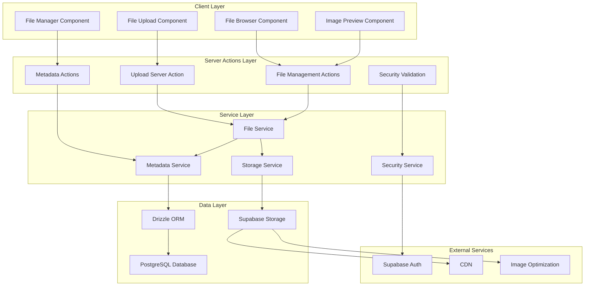
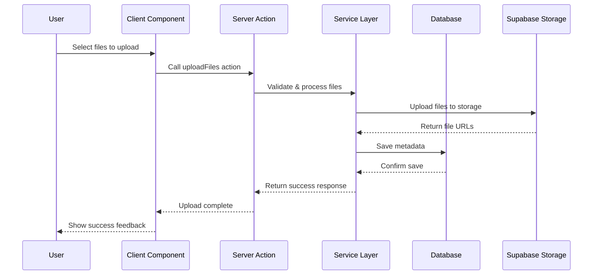
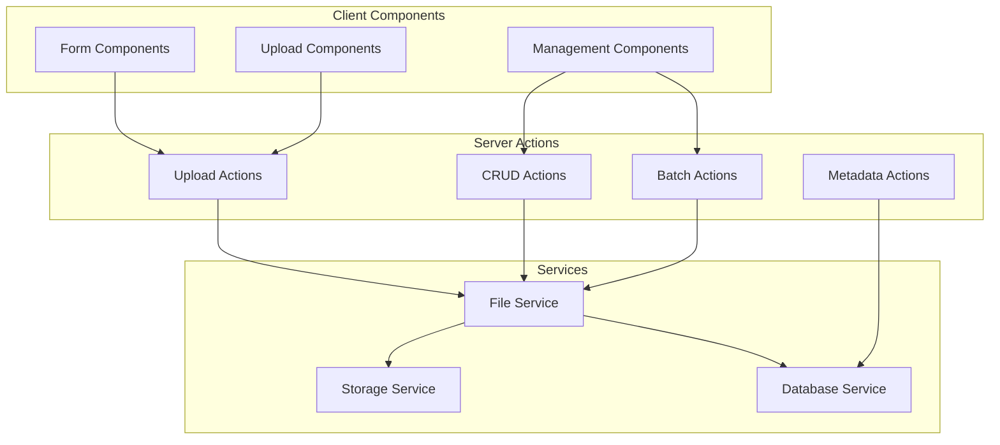
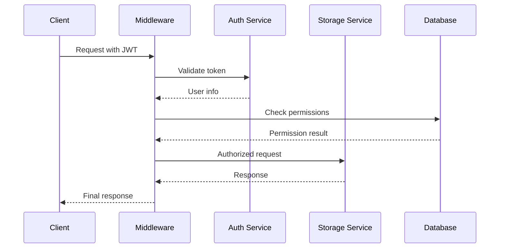
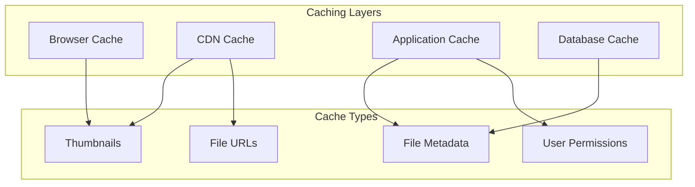

# Design Document

## Overview

This design document outlines the comprehensive integration of Supabase Storage with the existing Next.js 14+ application using Drizzle ORM. The system will extend the current media table structure to provide robust file upload, storage, and management capabilities with proper authentication, authorization, and performance optimization.

The integration leverages the existing Supabase authentication system and extends the current database schema to support advanced file management features including versioning, organization, and metadata tracking.

## Architecture

### System Architecture Diagram



### Data Flow Architecture



## Components and Interfaces

### Core Components Structure

```
src/
├── components/
│   └── files/
│       ├── FileUpload.tsx           # Main upload component
│       ├── FileDropzone.tsx         # Drag & drop interface
│       ├── FileProgress.tsx         # Upload progress tracking
│       ├── FileBrowser.tsx          # File browsing interface
│       ├── FileGrid.tsx             # Grid view for files
│       ├── FileList.tsx             # List view for files
│       ├── FilePreview.tsx          # File preview modal
│       ├── FileManager.tsx          # File management actions
│       ├── FolderTree.tsx           # Folder organization
│       └── ImageOptimizer.tsx       # Image optimization
├── lib/
│   ├── services/
│   │   ├── fileService.ts           # Core file operations
│   │   ├── storageService.ts        # Supabase storage wrapper
│   │   ├── metadataService.ts       # Database operations
│   │   └── securityService.ts       # Security validations
│   ├── utils/
│   │   ├── fileValidation.ts        # File validation utilities
│   │   ├── imageProcessing.ts       # Image processing utilities
│   │   └── uploadHelpers.ts         # Upload helper functions
│   └── types/
│       └── files.ts                 # TypeScript interfaces
└── app/
    └── actions/
        └── files/
            ├── upload.ts            # File upload server action
            ├── manage.ts            # File CRUD server actions
            ├── batch.ts             # Batch operations server actions
            └── metadata.ts          # Metadata server actions
```

### Component Interfaces

#### FileUpload Component

```typescript
interface FileUploadProps {
  onUploadComplete?: (files: UploadedFile[]) => void;
  onUploadError?: (error: string) => void;
  acceptedTypes?: string[];
  maxFileSize?: number;
  maxFiles?: number;
  folder?: string;
  showProgress?: boolean;
  allowMultiple?: boolean;
}
```

#### FileBrowser Component

```typescript
interface FileBrowserProps {
  userId?: string;
  folder?: string;
  viewMode?: 'grid' | 'list';
  selectable?: boolean;
  onFileSelect?: (file: FileMetadata) => void;
  filters?: FileFilters;
  pagination?: PaginationConfig;
}
```

#### FileManager Component

```typescript
interface FileManagerProps {
  fileId: string;
  onDelete?: () => void;
  onRename?: (newName: string) => void;
  onMove?: (newFolder: string) => void;
  permissions?: FilePermissions;
}
```

## Data Models

### Enhanced Database Schema

Building on the existing media table, we'll extend it with additional tables for comprehensive file management:

```typescript
// Enhanced files table (extends existing media table)
export const files = pgTable('files', {
  id: uuid('id').primaryKey().defaultRandom(),
  fileName: varchar('file_name', { length: 255 }).notNull(),
  originalName: varchar('original_name', { length: 255 }).notNull(),
  filePath: varchar('file_path', { length: 500 }).notNull(),
  fileSize: integer('file_size').notNull(),
  fileType: varchar('file_type', { length: 100 }).notNull(),
  mimeType: varchar('mime_type', { length: 100 }).notNull(),
  altText: text('alt_text'),
  caption: text('caption'),
  description: text('description'),

  // Storage information
  bucketName: varchar('bucket_name', { length: 100 }).notNull(),
  storageKey: varchar('storage_key', { length: 500 }).notNull(),
  publicUrl: varchar('public_url', { length: 1000 }),

  // Organization
  folderId: uuid('folder_id').references(() => folders.id),

  // Metadata
  metadata: jsonb('metadata'), // EXIF, dimensions, etc.
  tags: jsonb('tags'), // Array of strings

  // Versioning
  version: integer('version').notNull().default(1),
  parentFileId: uuid('parent_file_id').references(() => files.id),

  // Security
  isPublic: boolean('is_public').notNull().default(false),
  accessLevel: accessLevelEnum('access_level').notNull().default('private'),

  // Audit
  uploadedBy: uuid('uploaded_by')
    .notNull()
    .references(() => users.id),
  createdAt: timestamp('created_at').notNull().defaultNow(),
  updatedAt: timestamp('updated_at').notNull().defaultNow(),
  deletedAt: timestamp('deleted_at'), // Soft delete
});

// Folders table for organization
export const folders = pgTable('folders', {
  id: uuid('id').primaryKey().defaultRandom(),
  name: varchar('name', { length: 255 }).notNull(),
  path: varchar('path', { length: 1000 }).notNull(),
  parentId: uuid('parent_id').references(() => folders.id),
  ownerId: uuid('owner_id')
    .notNull()
    .references(() => users.id),
  isPublic: boolean('is_public').notNull().default(false),
  createdAt: timestamp('created_at').notNull().defaultNow(),
  updatedAt: timestamp('updated_at').notNull().defaultNow(),
});

// File shares for collaboration
export const fileShares = pgTable('file_shares', {
  id: uuid('id').primaryKey().defaultRandom(),
  fileId: uuid('file_id')
    .notNull()
    .references(() => files.id, { onDelete: 'cascade' }),
  sharedWith: uuid('shared_with')
    .notNull()
    .references(() => users.id),
  sharedBy: uuid('shared_by')
    .notNull()
    .references(() => users.id),
  permission: sharePermissionEnum('permission').notNull(),
  expiresAt: timestamp('expires_at'),
  createdAt: timestamp('created_at').notNull().defaultNow(),
});

// File access logs for monitoring
export const fileAccessLogs = pgTable('file_access_logs', {
  id: uuid('id').primaryKey().defaultRandom(),
  fileId: uuid('file_id')
    .notNull()
    .references(() => files.id),
  userId: uuid('user_id').references(() => users.id),
  action: accessActionEnum('action').notNull(),
  ipAddress: varchar('ip_address', { length: 45 }),
  userAgent: text('user_agent'),
  createdAt: timestamp('created_at').notNull().defaultNow(),
});

// Enums
export const accessLevelEnum = pgEnum('access_level', [
  'private',
  'shared',
  'public',
]);
export const sharePermissionEnum = pgEnum('share_permission', [
  'view',
  'download',
  'edit',
]);
export const accessActionEnum = pgEnum('access_action', [
  'view',
  'download',
  'upload',
  'delete',
  'share',
]);
```

### TypeScript Interfaces

```typescript
// Core file interfaces
export interface FileMetadata {
  id: string;
  fileName: string;
  originalName: string;
  filePath: string;
  fileSize: number;
  fileType: string;
  mimeType: string;
  altText?: string;
  caption?: string;
  description?: string;
  bucketName: string;
  storageKey: string;
  publicUrl?: string;
  folderId?: string;
  metadata?: Record<string, any>;
  tags?: string[];
  version: number;
  parentFileId?: string;
  isPublic: boolean;
  accessLevel: 'private' | 'shared' | 'public';
  uploadedBy: string;
  createdAt: Date;
  updatedAt: Date;
  deletedAt?: Date;
}

export interface FolderMetadata {
  id: string;
  name: string;
  path: string;
  parentId?: string;
  ownerId: string;
  isPublic: boolean;
  createdAt: Date;
  updatedAt: Date;
}

export interface UploadConfig {
  maxFileSize: number;
  allowedTypes: string[];
  bucketName: string;
  folder?: string;
  isPublic?: boolean;
  generateThumbnails?: boolean;
  optimizeImages?: boolean;
}

export interface UploadProgress {
  fileId: string;
  fileName: string;
  progress: number;
  status: 'pending' | 'uploading' | 'processing' | 'complete' | 'error';
  error?: string;
}

export interface ActionResult {
  success?: boolean;
  error?: {
    type: FileErrorType;
    message: string;
    code?: string;
    details?: any;
  };
  data?: any;
}
```

## Error Handling

### Error Classification System

```typescript
export enum FileErrorType {
  VALIDATION_ERROR = 'VALIDATION_ERROR',
  UPLOAD_ERROR = 'UPLOAD_ERROR',
  STORAGE_ERROR = 'STORAGE_ERROR',
  DATABASE_ERROR = 'DATABASE_ERROR',
  PERMISSION_ERROR = 'PERMISSION_ERROR',
  NOT_FOUND_ERROR = 'NOT_FOUND_ERROR',
  QUOTA_EXCEEDED = 'QUOTA_EXCEEDED',
  NETWORK_ERROR = 'NETWORK_ERROR',
}

export class FileError extends Error {
  constructor(
    public type: FileErrorType,
    message: string,
    public code?: string,
    public details?: any
  ) {
    super(message);
    this.name = 'FileError';
  }
}
```

### Error Handling Patterns

```typescript
// Server Action Error Handler
export function handleFileError(error: unknown): ActionResult {
  if (error instanceof FileError) {
    return {
      error: {
        type: error.type,
        message: error.message,
        code: error.code,
        details: error.details,
      },
    };
  }

  // Log unexpected errors
  console.error('Unexpected file operation error:', error);

  return {
    error: {
      type: FileErrorType.STORAGE_ERROR,
      message: 'An unexpected error occurred',
    },
  };
}

// Client Error Handler
export function handleClientError(error: FileError): void {
  switch (error.type) {
    case FileErrorType.VALIDATION_ERROR:
      toast.error(`Validation Error: ${error.message}`);
      break;
    case FileErrorType.QUOTA_EXCEEDED:
      toast.error('Storage quota exceeded. Please delete some files.');
      break;
    case FileErrorType.PERMISSION_ERROR:
      toast.error('You do not have permission to perform this action.');
      break;
    default:
      toast.error('An error occurred while processing your file.');
  }
}
```

## Server Actions Implementation

### Server Actions Architecture



### Server Action Patterns

#### File Upload Action

```typescript
'use server';

import { revalidatePath } from 'next/cache';
import { redirect } from 'next/navigation';

export async function uploadFiles(formData: FormData) {
  const files = formData.getAll('files') as File[];

  try {
    // Validate files
    const validationResults = await validateFiles(files);
    if (!validationResults.isValid) {
      return { error: validationResults.errors };
    }

    // Process uploads
    const uploadResults = await processFileUploads(files);

    // Revalidate relevant paths
    revalidatePath('/files');

    return { success: true, files: uploadResults };
  } catch (error) {
    return { error: 'Upload failed' };
  }
}
```

#### File Management Actions

```typescript
'use server';

export async function deleteFile(fileId: string) {
  try {
    await fileService.deleteFile(fileId);
    revalidatePath('/files');
    return { success: true };
  } catch (error) {
    return { error: 'Delete failed' };
  }
}

export async function updateFileMetadata(
  fileId: string,
  metadata: Partial<FileMetadata>
) {
  try {
    const updatedFile = await fileService.updateFile(fileId, metadata);
    revalidatePath('/files');
    return { success: true, file: updatedFile };
  } catch (error) {
    return { error: 'Update failed' };
  }
}
```

### Form Integration Patterns

#### Progressive Enhancement

```typescript
// Client component with server action
export function FileUploadForm() {
  const [pending, startTransition] = useTransition();

  async function handleSubmit(formData: FormData) {
    startTransition(async () => {
      const result = await uploadFiles(formData);
      if (result.error) {
        toast.error(result.error);
      } else {
        toast.success('Files uploaded successfully');
      }
    });
  }

  return (
    <form action={handleSubmit}>
      <input type="file" name="files" multiple />
      <button type="submit" disabled={pending}>
        {pending ? 'Uploading...' : 'Upload Files'}
      </button>
    </form>
  );
}
```

## Security Implementation

### Authentication & Authorization Flow



### Security Layers

#### 1. Authentication Layer

```typescript
export async function authenticateUser(request: Request): Promise<User | null> {
  const token = extractTokenFromRequest(request);
  if (!token) return null;

  const {
    data: { user },
    error,
  } = await supabase.auth.getUser(token);
  if (error || !user) return null;

  return user;
}
```

#### 2. Authorization Layer

```typescript
export async function authorizeFileAccess(
  userId: string,
  fileId: string,
  action: 'read' | 'write' | 'delete'
): Promise<boolean> {
  const file = await getFileById(fileId);
  if (!file) return false;

  // Owner has full access
  if (file.uploadedBy === userId) return true;

  // Check shared permissions
  if (file.accessLevel === 'public' && action === 'read') return true;

  // Check explicit shares
  const share = await getFileShare(fileId, userId);
  return share && hasPermission(share.permission, action);
}
```

#### 3. File Validation Layer

```typescript
export function validateFile(file: File): ValidationResult {
  const errors: string[] = [];

  // Size validation
  if (file.size > MAX_FILE_SIZE) {
    errors.push(`File size exceeds ${formatBytes(MAX_FILE_SIZE)}`);
  }

  // Type validation
  if (!ALLOWED_MIME_TYPES.includes(file.type)) {
    errors.push(`File type ${file.type} is not allowed`);
  }

  // Content validation (basic)
  if (file.type.startsWith('image/')) {
    // Additional image validation
  }

  return {
    isValid: errors.length === 0,
    errors,
  };
}
```

#### 4. RLS Policies

```sql
-- Files table RLS policies
CREATE POLICY "Users can view their own files" ON files
  FOR SELECT USING (uploaded_by = auth.uid());

CREATE POLICY "Users can view public files" ON files
  FOR SELECT USING (is_public = true);

CREATE POLICY "Users can view shared files" ON files
  FOR SELECT USING (
    id IN (
      SELECT file_id FROM file_shares
      WHERE shared_with = auth.uid()
    )
  );

CREATE POLICY "Users can upload files" ON files
  FOR INSERT WITH CHECK (uploaded_by = auth.uid());

CREATE POLICY "Users can update their own files" ON files
  FOR UPDATE USING (uploaded_by = auth.uid());

CREATE POLICY "Users can delete their own files" ON files
  FOR DELETE USING (uploaded_by = auth.uid());
```

## Performance Optimization

### Caching Strategy



### Optimization Techniques

#### 1. Image Optimization

```typescript
export async function optimizeImage(
  file: File,
  options: ImageOptimizationOptions
): Promise<OptimizedImage> {
  const canvas = document.createElement('canvas');
  const ctx = canvas.getContext('2d');
  const img = new Image();

  return new Promise((resolve, reject) => {
    img.onload = () => {
      // Calculate optimal dimensions
      const { width, height } = calculateDimensions(
        img.width,
        img.height,
        options.maxWidth,
        options.maxHeight
      );

      canvas.width = width;
      canvas.height = height;

      // Draw and compress
      ctx.drawImage(img, 0, 0, width, height);

      canvas.toBlob(
        (blob) => {
          if (blob) {
            resolve({
              file: new File([blob], file.name, { type: options.outputFormat }),
              originalSize: file.size,
              optimizedSize: blob.size,
              compressionRatio: blob.size / file.size,
            });
          } else {
            reject(new Error('Image optimization failed'));
          }
        },
        options.outputFormat,
        options.quality
      );
    };

    img.onerror = reject;
    img.src = URL.createObjectURL(file);
  });
}
```

#### 2. Lazy Loading Implementation

```typescript
export function useLazyFileLoading(
  files: FileMetadata[],
  pageSize: number = 20
) {
  const [loadedFiles, setLoadedFiles] = useState<FileMetadata[]>([]);
  const [loading, setLoading] = useState(false);
  const [hasMore, setHasMore] = useState(true);

  const loadMore = useCallback(async () => {
    if (loading || !hasMore) return;

    setLoading(true);
    const startIndex = loadedFiles.length;
    const endIndex = startIndex + pageSize;
    const newFiles = files.slice(startIndex, endIndex);

    setLoadedFiles((prev) => [...prev, ...newFiles]);
    setHasMore(endIndex < files.length);
    setLoading(false);
  }, [files, loadedFiles.length, loading, hasMore, pageSize]);

  return { loadedFiles, loading, hasMore, loadMore };
}
```

#### 3. Database Query Optimization

```typescript
export async function getFilesWithPagination(
  userId: string,
  options: PaginationOptions
): Promise<PaginatedResult<FileMetadata>> {
  const query = db
    .select()
    .from(files)
    .where(and(eq(files.uploadedBy, userId), isNull(files.deletedAt)))
    .orderBy(desc(files.createdAt))
    .limit(options.limit)
    .offset(options.offset);

  // Add filters if provided
  if (options.fileType) {
    query.where(eq(files.fileType, options.fileType));
  }

  if (options.folderId) {
    query.where(eq(files.folderId, options.folderId));
  }

  const [results, totalCount] = await Promise.all([
    query.execute(),
    db
      .select({ count: count() })
      .from(files)
      .where(and(eq(files.uploadedBy, userId), isNull(files.deletedAt)))
      .execute(),
  ]);

  return {
    data: results,
    total: totalCount[0].count,
    hasMore: options.offset + options.limit < totalCount[0].count,
  };
}
```

This design provides a comprehensive foundation for implementing the Supabase Storage integration with proper architecture, security, performance optimization, and testing strategies. The design builds upon the existing project structure and extends it with robust file management capabilities.
